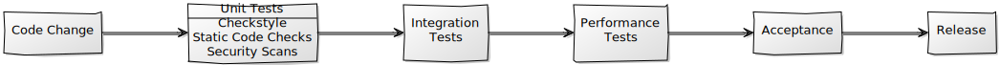

<style type="text/css">
  .reveal {
   font-size: 30px;
  }
  .reveal p {
    text-align: left;
  }
  .reveal ul {
    display: block;
  }
  .reveal ol {
    display: block;
  }
  img {
   display: block ! important;
   width: auto ! important;
   margin: auto ! important;
   border: 0 ! important;
   box-shadow: none ! important;
  }
</style>
---
# Grundlegende Tools und Prozesse zur Qualitätssicherung

---
## Am Ende dieses Moduls ...
... verstehen Sie den Unterschied zwischen CI und CD.

... kennen Sie Tools mit dennen Sie eine Pipeline erstellen können.

... können Sie selbst eine Automatisierung aufbauen.

---
## Warum ist Software Qualität wichtig?

|Jahr| Beschreibung |
|---|---|
| 2014 | Amazon Produkte für 0,01 Pfund angeboten.
| 2012 | Knight Capital verliert innerhalb von 45 Minuten 359 Millionen Euro.
| 1998 | Mars Climate Orbiter verpasst Mars weil unterschiedliche Maßeinheiten genutzt wurden.
| 1996 | Navy Schiff Yorktown konnte Aufgrund einer Division durch null für drei Stunden nicht navigiert werden.
| 1992 | Rettungsdienst Software bei Einführung überlastet. Dadurch werden Einsatzkräfte falsch verteilt.

Note: https://erichmusick.com/writings/technology/1992-london-ambulance-cad-failure.html
---
## Software Qualität früher
* Zentrale Verantwortung 
* Manuelles Testen
* Auslagerung der Tests an Subunternehmen

> Schlechte Qualität durch komplexe Prozesse und lange Entwicklungszyklen

---
## Software Qualität heute
* Teams sind selbst verantwortlich
* Hohe Automatisierung
* Tests werden oft von Entwicklern durchgeführt

> Gute Qualität durch durch Software unterstützte Prozesse und kurze Entwicklungszyklen

---
## Was ist CI?
* Kontinuierliche Integration 
* Häufige Integration der Arbeitsergebnisse
* Kurze Testzyklen
* Kontinuierliche Entwicklung von Tests
* Eine Codebasis

---
## Was ist CD?
* Kontinuierliche Lieferung
* Kurze Lieferkette
* Automatisierte Pipeline die von Entwicklung bis zur Produktion geht

---
## Beispiel CI/CD Pipeline



Note: [Code Change]->[Unit Tests|Checkstyle;Static Code Checks;Security Scans], [Unit Tests]->[Integration Tests], [Integration Tests] -> [Performance Tests], [Performance Tests] -> [Acceptance], [Acceptance] -> [Release]

---
## Tools
|Bezeichnung|Lizenz|Config via|Erscheinungsjahr|
|---|---|---|---|---|
|Jenkins|MIT|Web/Yaml|2011|
|Concourse|Apache 2.0|Yaml|2014|
|GitLab CI|MIT|Yaml|2015|
|Circle CI|Enterprise License|Yaml|2016|
|Travis CI|MIT|Yaml|2011|

---
### Pipeline as code
* Konzept zur Automatisierung der Pipeline Erstellung
* Versionierung möglich
* Können selbst validiert werden, bevor diese verwendet werden
* Unterschiedliche Umsetzungen
  * Jenkinsfiles
  * Yaml
* Probleme
  * Zugangsdaten
  * Parallele Ausführung
  * Austausch von Zuständen
  

---
# Formate
---
## XML
* E**X**tended **M**arkup **L**anguage
	* Markup: **markieren** eines Textes

* Beispiel:
```
  <Engineer>
    <name>Linus Torvalds</name>
    <age>48</age>
    <software>
      <software>
        <name>Linux</name>
        <license>GPL v2</license>
      </software>
      <software>
        <name>Git</name>
        <license>GPL v2</license>
      </software>
    </software>
  </Engineer>
```
---

### XML: Bestandteile
* XML - **Element**: 	
	```
	<person>...</person>
	```
	
* XML - **Tag**: 	
	```
	<person>
	```
	Starttags werden durch Endttags geschlossen. Ausser: Leerelemente

* XML - **Text**:
	```
	<message>Hi, wie geht`s?</message>
	```	

* XML - **Attribut**:
	```
	<person "age"="40">...</person>
	```	

* Kommentare:
	```
	<!-- Das ist ein Kommentar -->
	```
---
### XSD: XML Schema Definition

* Definiert und validiert die Struktur eines XML Dokumentes.

```
<xs:schema xmlns:xs = "http://www.w3.org/2001/XMLSchema">
   <xs:element name = 'class'>
      <xs:complexType>
         <xs:sequence>
             <xs:element name = 'student' type = 'StudentType' minOccurs = '0' 
                maxOccurs = 'unbounded' />
         </xs:sequence>
      </xs:complexType>
   </xs:element>

   <xs:complexType name = "StudentType">
      <xs:sequence>
         <xs:element name = "firstname" type = "xs:string"/>
         <xs:element name = "lastname" type = "xs:string"/>
      </xs:sequence>
   </xs:complexType>			 
</xs:schema>
```

```
<class>  
   <student>
      <firstname>Max</firstname>    
      <lastname>Muster</lastname>
   </student>   
   <student>
      <firstname>Lisa</firstname>    
      <lastname>Müller</lastname>
   </student>
<class>
```
---
### XML: Weitere Informationen

* [www.selfhtml.org/wiki/XML/](https://wiki.selfhtml.org/wiki/XML/Regeln/Tags,_Attribute,_Wertzuweisungen_und_Kommentare)
* [www.tutorialspoint.com/de/xml/](https://www.tutorialspoint.com/de/xml/xml_syntax.htm)
* [www.tutorialspoint.com/xsd/](https://www.tutorialspoint.com/xsd/xsd_validation.htm)

---
## Übung: 
### Aufgabe 1 + Aufgabe 2.1 (XML)

---
## JSON
* **J**ava**S**cript **O**bject **N**otation
* Beispiel:

```
{
  "name" : "Linus Torvalds",
  "age" : 48,
  "software" : [ 
    {
      "name" : "Linux",
      "license" : "GPL v2"
    }, {
      "name" : "Git",
      "license" : "GPL v2"
    } 
  ]
}
```
---
### JSON: Spezifikation
* Spezifiziert von Douglas Crockford (kompakt genug für eine Visitenkarte).


---
### JSON: Bestandteile
* **object**: 	
	```
	{ <pair>, .. }
	```
	
	Beispiel:
	```
	{"name" : "Max", .. }
	```
  
* **pair** (auch property gennant): 	
	```
	<key>:<value>
	```
	
* **value**:
	* **array**: ``["adidas", "nike", "asics"]``
	* **string**: ``"Max"``
	* **number**: ``2.1``
	* **true**, **false**, **null**
	* oder (!): **object**

---
### JSON Schema
```
{
   "type" : "object",
   "properties" : {
      "students" : {
         "type" : "array",
         "items" : {
            "type" : "object",
            "properties" : {
               "firstname" : {
                  "type" : "string",
                  "pattern" : "[a-zA-Z]+"
               },
               "lastname": {
                  "type" : "string",
                  "pattern" : "[a-zA-Z]+"
               }
            }
         }
      }
   }
}
```

```
{
   "students": [ {
         "firstname" : "Max",
         "lastname" : "Muster"
      } , {
         "firstname" : "Lisa",
         "lastname" : "Müller"
      }
   ]
}
```
---
### JSON: Weitere Informationen
* [json.org](https://www.json.org)
* [json-schema.org](https://json-schema.org/)

---
## Übung: 
### Aufgabe 2.2 (JSON)

---
## YAML
* „YAML Ain’t Markup Language“ (ursprünglich „Yet Another Markup Language“).

```
name: "Linus Torvalds"
age: 48
software:
- name: "Linux"
  license: "GPL v2"
- name: "Git"
  license: "GPL v2"
```
---
## YAML Bestandteile:
* YAML ist ein *superset* von JSON.

* **Scalar** (JSON: value): 	
	* string z.B. ``"hallo"`` oder ohne quotes(!) ``hallo``
	* number z.B. ``2.91``

* **Sequence** (JSON: array)
	* Beispiel:

		```
		- milk
		- cheese
		- coke
		```
	* Oder *inline* 
		
	```
	[milk, cheese, coke]
	```

---
## YAML Bestandteile #2
* **Mapping** (JSON: pair/property)
	* Beispiel:
	```
	name: Stefan
	age: 28
	```
	
	* Oder *inline* 
	
	```
	{name: Stefan, age: 28}
	```
  
* **Comment**:
	
```
# settings
power: 50	
```
---
### YAML: Weitere Informationen
* [tutorialspoint.com/yaml](https://www.tutorialspoint.com/yaml/yaml_basics.htm)

---
## Übung: 
### Aufgabe 2.3 (YAML)

---
## End