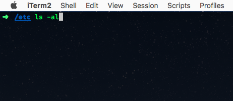

---
# Grundlagen von Linux <!-- .element style="font-size: 100pt;" -->

---
## Inhalte
1. Geschichte
2. Kernel
4. Verzeichnisstruktur
5. Shell Befehle
6. Debian Softwarepakete

---
<section style="text-align: left;">

## Am Ende dieses Moduls ...
 
... haben Sie Ubuntu Linux in einer VM eingerichtet

... verstehen Sie die Linux Verzeichnisstruktur

... kennen Sie die wichtigsten Linux Shell Befehle

... können Sie Linux Softwarepakete installieren

---

# Geschichte
Das Unix-Betriebssystem wurde von Ken Thompson und Dennis Ritchie (Firma AT&T Bell Labs) im Jahr 1969 entwickelt und 1970 erstmals veröffentlicht.

---
## BSD
Im Jahr 1977 veröffentlichte die Berkeley Universität ein UNIX-ähnliches System, Berkeley Software Distribution (BSD). Da BSD zu dieser Zeit AT&T Coding enthielt war es allerdings nur mit gültiger UNIX Lizenz nutzbar.

---
## GNU
1983 startete Richard Stallman das GNU-Projekt, um ein freies UNIX-ähnliches Betriebssystem zu erstellen. Dabei wurde unter anderem eine Compiler Toolchain, ein Codeeditor und eine Shell entwickelt. Allerdings fehlte es dem Projekt lange an einem vollständigen Betriebssystemkern (Kernel).

---
## MINIX
1987 veröffentlichte Andrew S. Tanenbaum MINIX, ein Unix-ähnliches System für den akademischen Gebrauch. Während der Quellcode für das System verfügbar war, wurde eine Modifizierung nicht gestattet.

---
## 25.08.91

<section style="text-align: left; size:10px;">
  Hello everybody out there using minix -

  I'm doing a (free) operating system (just a hobby, won't be big and
  professional like gnu) for 386(486) AT clones.  This has been brewing
  since april, and is starting to get ready.  I'd like any feedback on
  things people like/dislike in minix, as my OS resembles it somewhat
  (same physical layout of the file-system (due to practical reasons)
  among other things). [..]

  Linus (torvalds@kruuna.helsinki.fi)
                
---
## Linus Benedict Torvalds

* Geboren: 29.12.1969 (Alter 48)
* Geburtsort: Helsinki, Finnland
* Chefentwickler des Linux Kernel
* Erfinder von GIT

---
# Linux
Torvalds entwickelte den Kernel und komplettierte diesen mit Software aus dem GNU Projekt zu dem Betriebssystem Linux.
Linux ist ein freies Betriebssystem, das unter der GPL Lizenz zur Verfügung gestellt wird.

---
## Einsatzgebiete:

* Server Betriebssysteme (Marktanteil ca. 35% im Jahr 2015 lt. W3Techs, Dunkelziffer weitere 30%)
* Smartphones (Android)
* Embedded Geräte (auch Raspberry Pi!)
* Desktop Betriebssysteme
* Supercomputer

---
## Kernel

---
## Distributionen
<section style="text-align: left;">
Eine Distribution fasst den Linux-Kernel mit verschiedener Software zu einem Betriebssystem zusammen, das für die Endnutzung geeignet ist. Dabei passen viele Distributoren und versierte Benutzer den Kernel an ihre eigenen Zwecke an. Beliebte Distributionen: 

* Debian
* Ubuntu
* Suse
* Redhat
* [usw..](https://distrowatch.com/)

---
## Verzeichnisstruktur
|Verzeichnis|Beschreibung|
|---|---|
|/bin|Von: *binaries*; enthält für Linux unverzichtbare Programme|
|/boot| Enthält zum Booten benötigte Dateien; Kernel, initiale Ramdisk|
|/dev|Von: *devices*; enthält alle Gerätedateien, über die die Hardware im Betrieb angesprochen wird|
|/etc|Von: *editable text configuration*  enthält Konfigurations- und Informationsdateien des Basissystems|
|/home|Von: *home-directory* (Heimatverzeichnis); enthält pro Benutzer ein Unterverzeichnis|
|/lib |Von: *libraries*; enthält Bibliotheken für dynamisch gelinkte Programme des Basissystems|

---

|Verzeichnis|Beschreibung|
|---|---|
|/proc|Von: *processes*; enthält Schnittstellen zum aktuell geladenen Kernel und seinen Prozeduren|
|/root|Ist das Homeverzeichnis des Superusers (root)|
|/sbin|Von: *system binaries*; enthält Programme für essentielle Aufgaben der Systemverwaltung;  Beispiele: shutdown|
|/usr|Von: *user*; enthält die meisten Systemtools, Bibliotheken und installierten Programme; der Name ist historisch bedingt - früher, als es /home noch nicht gab, befanden sich hier auch die Benutzerverzeichnisse|
|/var|Von: *variable* (variabel);  enthält Dateien die zur Laufzeit des Systems geschrieben werden; Beispiele: Log-Dateien (/var/log)
---
## Übung 1 - Setup

---
## Shell & Terminal

Die **Shell** oder auch **Kommandozeileninterpreter** ist ein Programm das Textbefehle interpretiert und dem Betriebssytem zur Ausführung übergibt. Bevor es grafische Benutzeroberflächen (GUIs) gab, war dies die einzige Eingabemöglichkeit um mit dem Computer zu interagieren.

Das **Terminal** oder auch **Terminalemulator** ist ein Programm das Keyboardeingaben an die Shell übergibt. Es gibt verschiende Terminalemulator-GUIs die erweiterte Features wie z.B. Scrolling und Tabs unterstützen.

---
## Terminal Basics

|Befehl|Beschreibung|
|---|---|
|`ctrl + c`|Beendet den gestarteten prozess; Leert die Eingabezeile|
|`ctrl + l`|Leert den Terminalscreen|
|`↑`, `↓`|Navigiert in der Historie der letzten Befehle|
|`ctrl+r`, `ctrl+s`|Sucht in der Befehlshistorie|

---
## Shell Basics
|Befehl|Beschreibung|
|---|---|
|`man`|**man**ual pages - öffnet die Befehlsbeschreibung|
|`--help`|Konvention vieler CLIs um eine Hilfe anzuzeigen|

Beispiele:
* `man git`
* `git --help`
---
## Dateien & Ordner

|Befehl|Beschreibung|Beispiel|
|---|---|---|
|`pwd`|**p**rint **w**orking **d**irectory - Zeigt den aktuellen Pfad an. |`pwd`|
|`mkdir`|**m**a**k**e **dir**ectory - legt ein neues Verzeichnis an |`mkdir myfolder`|
|`touch`|Legt eine leere Datei an oder modifiziert deren Zeitstempel |`touch myfile`|
|`cd`|**c**hange **d**irectory - wechselt den Pfad|`cd myfolder`, `cd ..`|
|`ls`|**l**i**s**t - zeigt die Inhalte eines Verzeichnisses an  |`ls -a`|
|`rm`|**r**e**m**ove - entfernt Dateien/Ordner  |`rm -rf myfolder`|
|`mv`|**m**o**v**e - verschiebt Dateien/Ordner  |`mv folder1/* folder2/`|
|`cp`|**c**o**p**y - kopiert Dateien/Ordner  |`cp -R folder1 folder2`|

---
|Befehl|Beschreibung|Beispiel|
|---|---|---|
|`find`|Datei-/Ordnersuche|`find / -name "myfile"`|
|`df`|**d**isplay **f**ree disk space - freien Speicherplatz der Laufwerke anzeigen|`df -H`|
|`du`|**d**isplay disk **u**sage - Speicherverbrauch von Dateien/Ordnern anzeigen|`du -H`|

---
## Übung 2 - Basics

---
## Pipes/Streams

|Befehl|Beschreibung|Beispiel|
|---|---|---|
|`❘`|Pipe Operator - verbindet Ein- und Ausgabe zweier Programme|`cat file ❘ grep "text"`|
|`grep`|Sucht in einer Datei bzw. einem Stream|`grep -i "hello" myfile`|
|`less`|Zeigt eine große Datei bzw. einen Datenstrom scrollbar an|`cat longfile ❘ less`|
|`tail`; `head`|Zeigt den Anfang/das Ende einer Datei bzw. eines Datenstroms an|`cat file ❘ tail -n 5`|
|`xargs`|Führt einen Befehl für jede Zeile eines Datenstroms aus|`seq 10 ❘ xargs -I {} echo "Zahl {}"`|

---
## Dateirechte
|Befehl|Beschreibung|
|---|---|
|`chmod `|**ch**ange **mod**e - ändert die Zugriffsberechtigung|
|`chown `|**ch**ange **own**er - ändert den Owner (Datei/Ordner)|

---

||**r**ead *r*:4|**w**rite *w*:2|e**x**ecute *x*:1|**command symbolic**|**command octal**|
|---|---|---|---|---|---|
|**u**sers|✓|||chmod u=r|chmod 400|
|**g**roups||✓||chmod g=r|chmod 040|
|**o**thers|||✓|chmod o=r|chmod 004|

 
* Oktalberechnung: rwx = 4 + 2 + 1 = 7

---
## Prozesse
|Befehl|Beschreibung|Beispiel|
|---|---|---|
|`top `| Zeigt aktive Prozesse *live* an|`top` (`o`, `cpu`)|
|`ps `|**p**rocess **s**tatus - zeigt aktive Prozesse als Liste|`ps -aux`|
|`kill`|Beendet einen Prozess|`kill 1001`|
|`netstat`|**n**etwork **s**tatus - zeigt offene Netzwerkverbindungen|`netstat -tulpen`|
|`nohup &`|**no** **h**ang**up** - startet einen Prozess im Hintergrund |`nohup myapp &`|
|`which`|Zeigt den Speicherort eines Programms an|`which ps`|

---
## Übung 3 - Pipes

---
## System & Nutzer

|Befehl|Beschreibung|Beispiel|
|---|---|---|
|`adduser`|Fügt einen Nutzer hinzu|`adduser hugo`|
|`deluser `|Entfernt einen Nutzer|`deluser --remove-home hugo`|
|`su`|**su**bstitude - wechselt den Benutzer|`su hugo`|
|`whoami`|Zeigt den aktuell aktiven Nutzer an||
|`sudo`|Führt einen Befehl als Root aus|`sudo deluser ...`|
|`shutdown`|Beendet/Startet den Computer neu|`shutdown -h now`, `shutdown -r now`|

---
## Und viele Weitere.. 
* awk, sed, jq, seq, uniq, date, ...

---
## Debian Softwarepakete

|Befehl|Beschreibung|
|---|---|
|apt-get update|Neueinlesen der Paketlisten|
|apt-cache search|Sucht in der Paketliste|
|apt-get install <paket>|Installation eines Paketes|
|apt-get remove <paket>|Deinstallation eines Paketes|
|apt-get purge|Wie remove, entfernt aber zusätzlich die Konfiguration|
---

|Befehl|Beschreibung|
|---|---|
|apt-get upgrade|Update vorhandener Pakete; hält Pakete stabil, siehe dist-ugprade|
|apt-get dist-upgrade|Update vorhandener Pakete, installiert wenn nötig zusätzliche Pakete oder entfernt nicht mehr benötigte|

---
## End