# Übung 1: Setup einer Ubuntu VM

## Virtualbox Setup
Laden & Installieren Sie Virtualbox von:
[https://www.virtualbox.org/wiki/Downloads](https://www.virtualbox.org/wiki/Downloads) 

(Windows-Nutzer: Windows Hosts, Mac-User: Mac Hosts..)

## Ubuntu Setup
Laden Sie die aktuelle Version (.iso) von Ubuntu Desktop:
[https://www.ubuntu.com/download/desktop](https://www.ubuntu.com/download/desktop)

### Installation

1. Neue virtuelle Maschine anlegen
	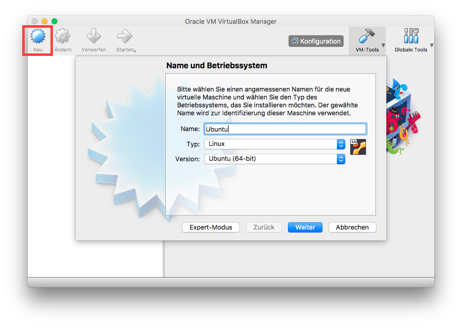
	
2. Speichergröße (RAM) festlegen
	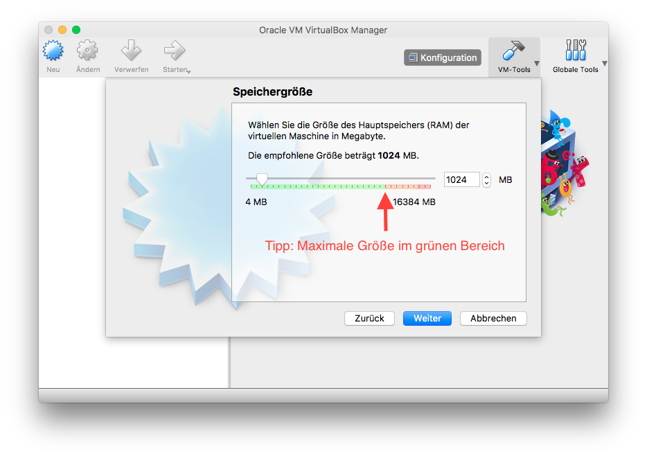
3. Festplatte erzeugen
	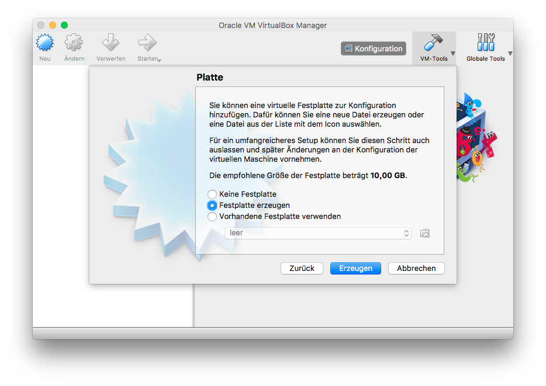
	
4. Dateityp der Festplatte
	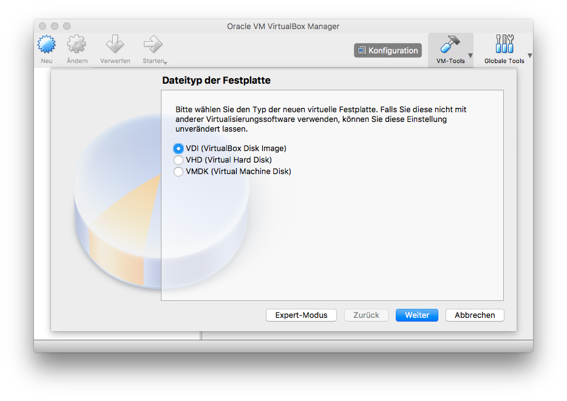
	
5. Dynamische allokation der Speichergröße
	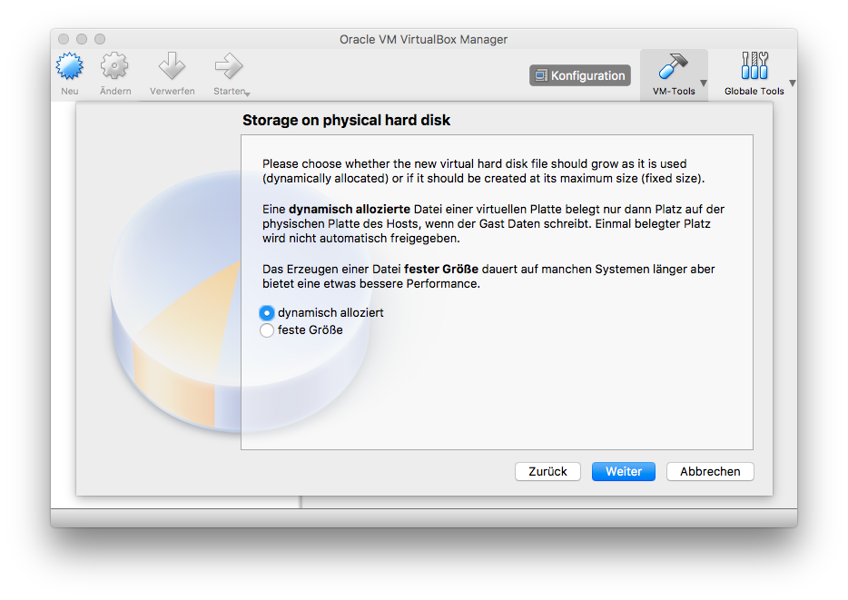
	
6. Maximale Größe der Festplatte
	
	
7. Starten Sie die virtuelle maschine und wählen Sie die heruntergeladenen Ubuntu Version (.iso)
	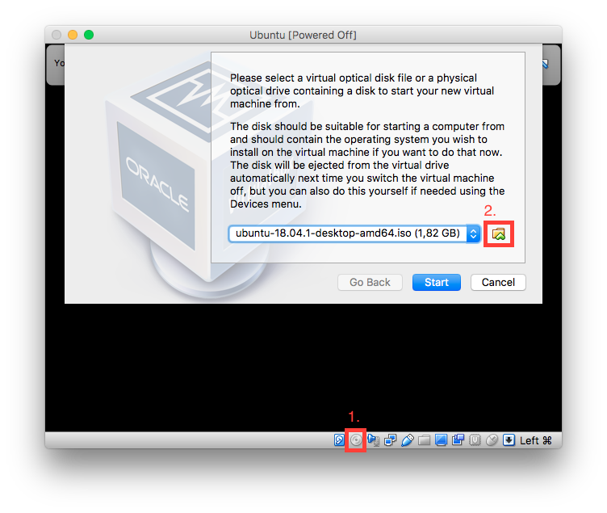
	
8. Ubuntu Installation
	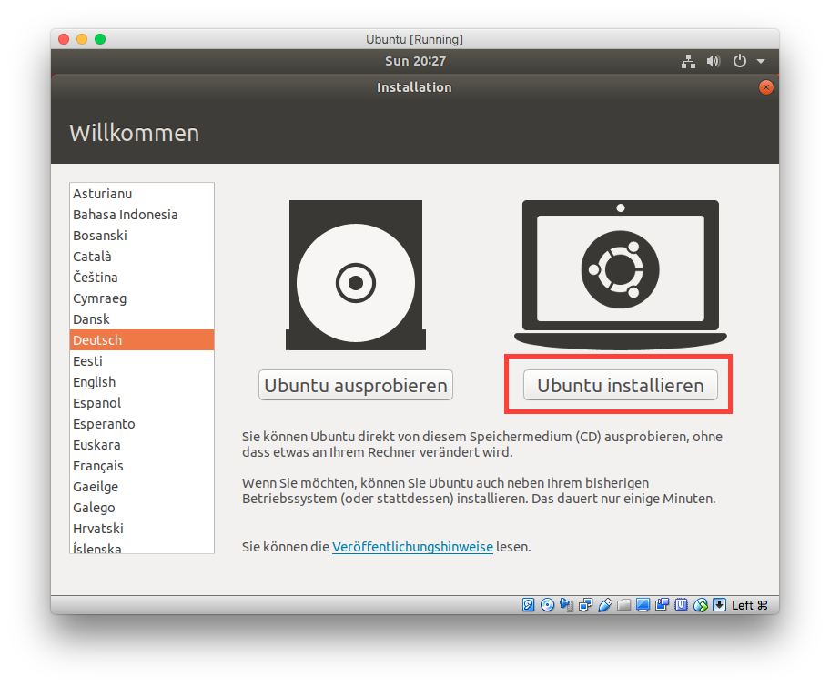
	
9. Spracheinstellungen
	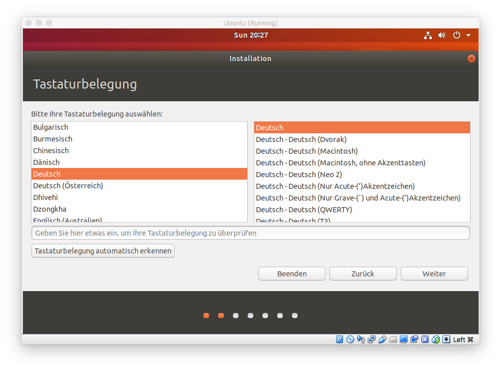
	
10. Installationsart
	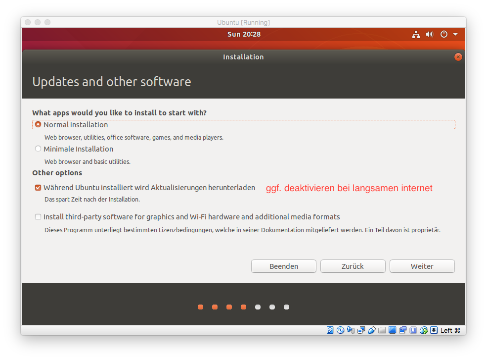
	
11. VM Festplatte löschen
	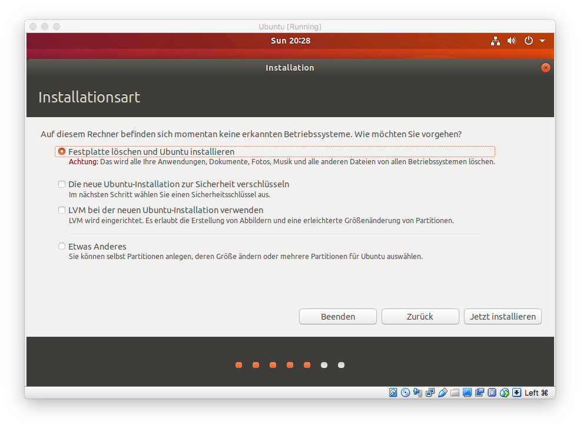
	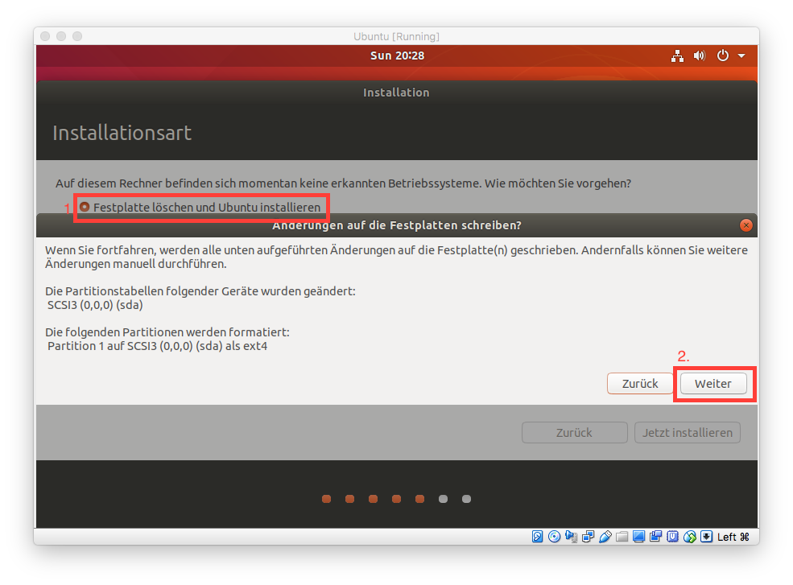
	
12. Zeitzone
	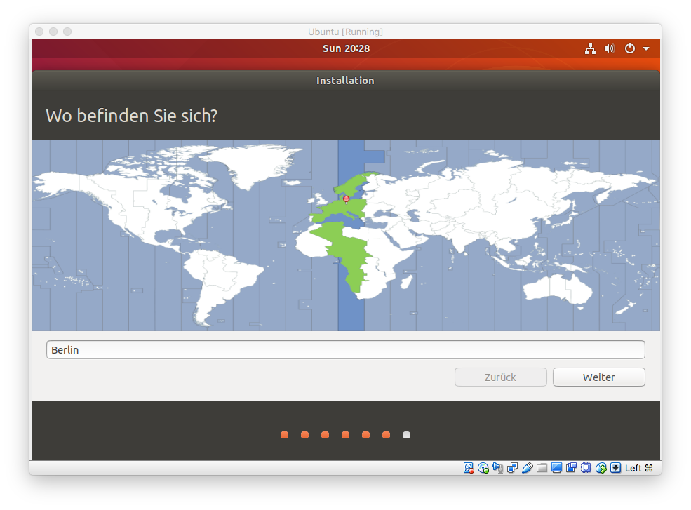
	
13. Username & Passwort
	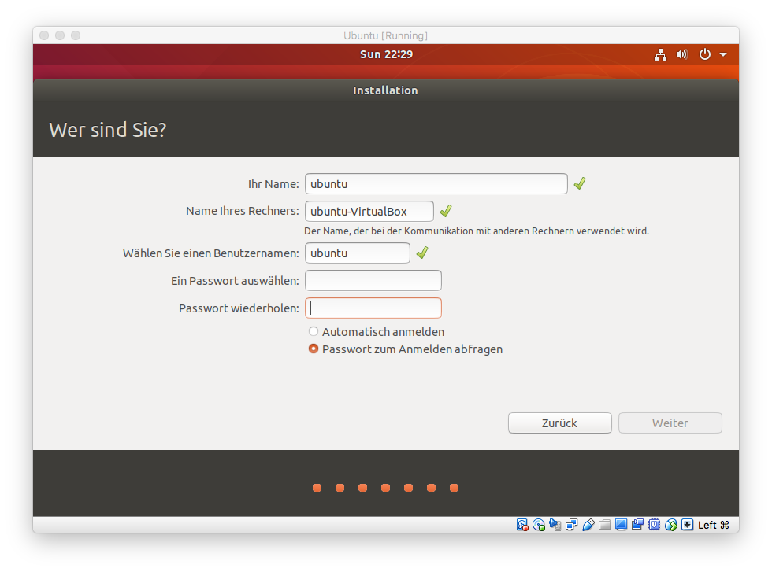
	
14. Ubuntu Installation läuft..

15. Gasterweiterungen installieren
	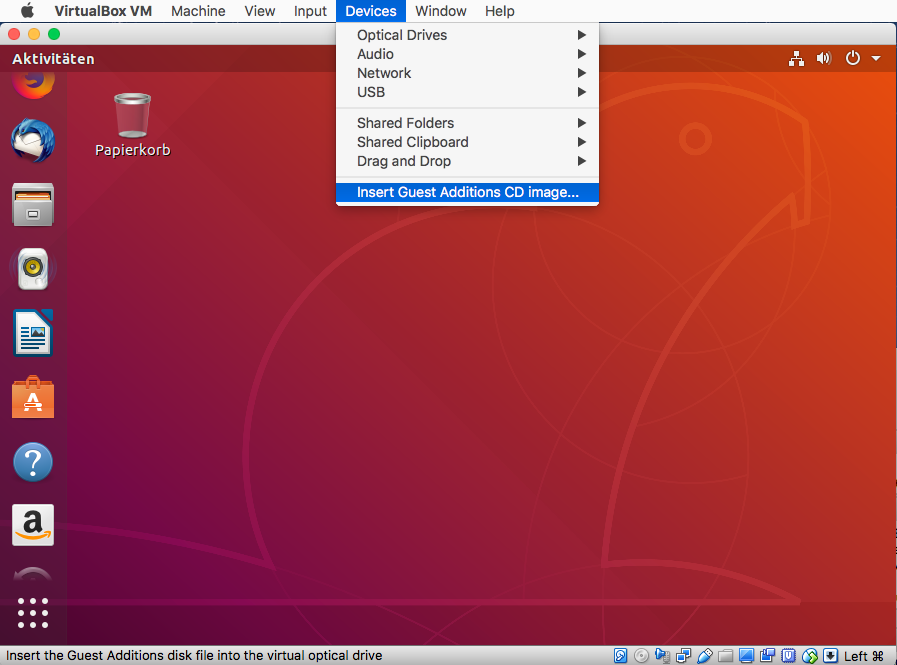
	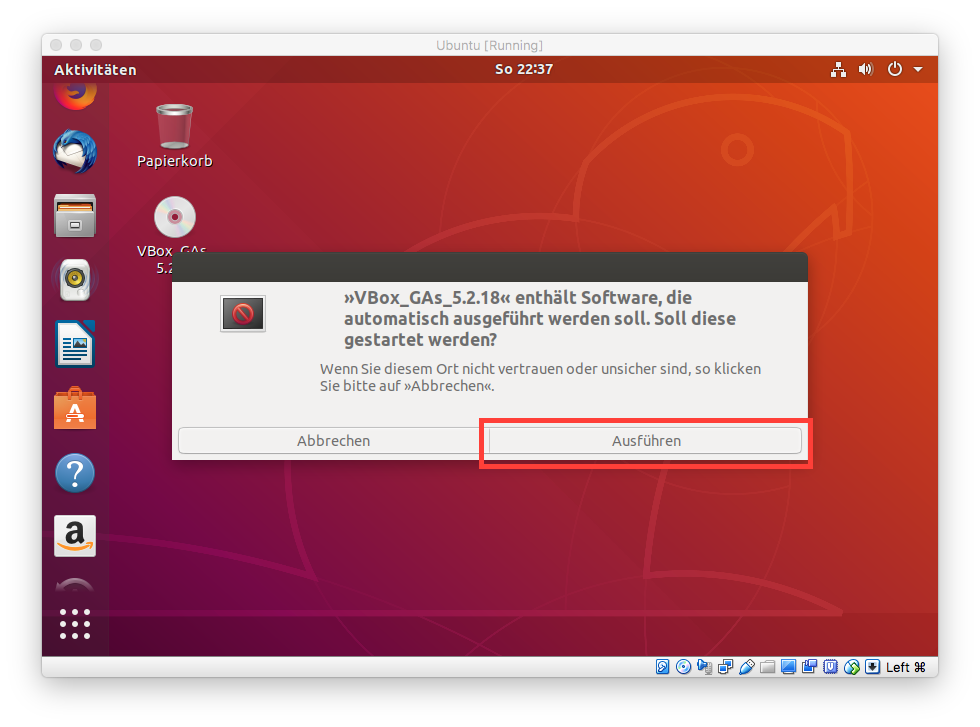
	
***Herzlichen Glückwunsch!***

Sie sollten nun ein funktionstüchtiges Ubuntu Linux installiert haben.

